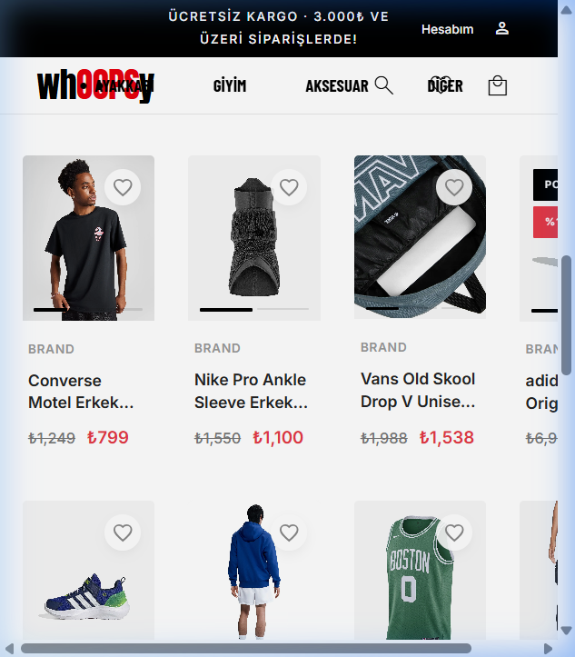
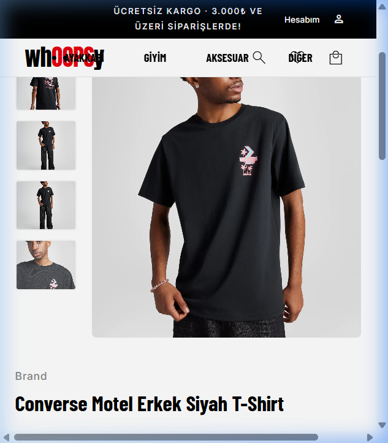
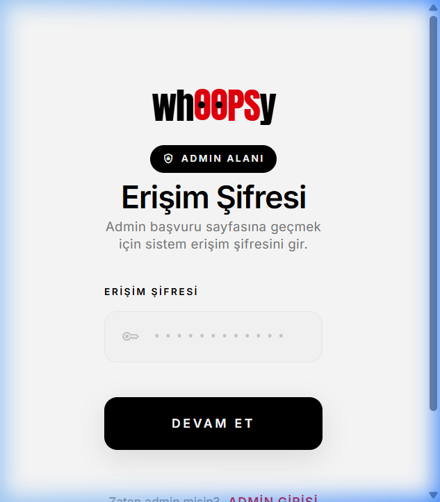

#  Whoopsy — Modern Full-Stack E-Ticaret Platformu

<p align="center">
  
  
  
  
  
  
  
</p>

<p align="center">
  <a href="https://CANLI_SİTE_LİNKİNİZ.com">
    
  </a>
</p>

---

##  Uygulama Ekran Görüntüleri

<table align="center" width="100%">
  <tr>
    <td align="center" width="50%">
      <b>Ana Sayfa, Çoklu Filtreleme & Ürün Kataloğu</b><br/><br/>
      
    </td>
    <td align="center" width="50%">
      <b>Ürün Detay Sayfası & Galeri</b><br/><br/>
      
    </td>
  </tr>
  <tr>
    <td align="center" colspan="2">
      <br/>
      <b>Yönetici Güvenlik Kapısı (Admin Gate Authentication)</b><br/><br/>
      
    </td>
  </tr>
</table>

---

##  Proje Genel Bakışı

**Whoopsy**, kurumsal standartlarda tasarlanmış, **Onion Architecture** (Soğan Mimarisi) ve **CQRS (Command Query Responsibility Segregation)** prensipleri üzerine inşa edilmiş modern, ölçeklenebilir ve tam kapsamlı bir e-ticaret platformudur.

Proje; yüksek performanslı bir **.NET 10 Web API** backend'i, modern ve reaktif bir **Angular 21** web arayüzü ve platformlar arası mobil erişim sunan **Flutter** mobil istemcisini bir araya getirir.

---

##  Öne Çıkan Özellikler

###  Müşteri Deneyimi & Vitrin
- **Gelişmiş Ürün Kataloğu:** Marka, kategori, alt kategori, cinsiyet, fiyat aralığı ve stok durumuna göre çok kriterli filtreleme & sayfalama (pagination).
- **Hiyerarşik Kategori Ağacı:** Ana kategoriler ve alt kategorilerden oluşan dinamik kategori ağacı (`GetCategoryTree`).
- **Detaylı Ürün Sayfası & Galeri:** Cloudinary CDN üzerinde optimize edilmiş çoklu ürün fotoğrafları ve detaylı teknik özellikler.
- **Dinamik Sepet & Favoriler:** Kullanıcı bazlı, tarayıcı ve API ile senkronize çalışan sepet ve favori ürün yönetimi.
- **Güvenli Ödeme & Checkout:** **Iyzico Sandbox** entegrasyonu ile gerçekçi 3D Secure / sanal POS ödeme akışı ve sipariş onay süreci.
- **Kullanıcı Profili:** Kişisel bilgiler, teslimat adresleri ve geçmiş siparişlerin durum takibi.

###  Yönetici (Admin) & Güvenlik Altyapısı
- **Özel Yetkilendirme Kapısı (Admin Gate):** Spam ve yetkisiz başvuruları engellemek için güvenlik kapısı şifresi (`GatePassword`).
- **Admin Onay Akışı (Approval Flow):** Yeni yönetici başvurularının süper admin onayı/reddi mekanizması ve otomatik e-posta bilgilendirmeleri.
- **JWT & Refresh Token:** Güvenli oturum açma, otomatik token yenileme ve rol tabanlı erişim denetimi (`[Authorize(Roles = "Admin")]`).
- **Admin Kontrol Paneli:** Ürün yönetimi, kategori tanımlama, sipariş takibi ve başvuru onaylama paneli.

---

##  Mimari ve Tasarım Prensipleri

```
MiniETicaret/
├── backend/
│   └── src/
│       ├── Core/
│       │   ├── MiniETicaret.Domain/          # Temel varlıklar (Entities), Enum'lar, Arayüzler
│       │   └── MiniETicaret.Application/     # CQRS Handlers, DTO'lar, FluentValidation, MediatR Behaviors
│       ├── Infrastructure/
│       │   ├── MiniETicaret.Infrastructure/  # JWT Token, Cloudinary, Iyzico, Mail/SMTP Servisleri
│       │   └── MiniETicaret.Persistence/     # EF Core 10, PostgreSQL DbContext, Repository & Migrations
│       └── Presentation/
│           └── MiniETicaret.API/             # RESTful Controllers, Middleware'ler, Swagger & Yapılandırma
├── frontend/                                 # Angular 21 Standalone Components, Material UI, RxJS, Vite
└── mobile/                                   # Flutter Cross-Platform Mobil İstemci
```

###  Kullanılan Mimari Kalıplar ve Teknolojiler

| Katman / Konu | Teknoloji & Kalıp | Açıklama |
|---|---|---|
| **Yazılım Mimarisi** | Onion Architecture (Clean Architecture) | Bağımlılıkların dıştan içe aktığı, test edilebilir ve gevşek bağlı mimari. |
| **İş Mantığı & CQRS** | MediatR | Okuma (Query) ve yazma (Command) işlemlerinin net olarak ayrıştırılması. |
| **Validasyon & Pipeline**| FluentValidation + MediatR Behaviors | İstekler işlenmeden önce otomatik doğrulama ve logging pipeline'ı. |
| **Veri Tabanı & ORM** | PostgreSQL 17 + Entity Framework Core 10 | Code-First yaklaşımı, migration yönetimi ve ilişkisel veri modeli. |
| **Görsel Depolama** | Cloudinary CDN | Ürün fotoğraflarının bulutta güvenli ve optimize depolanması. |
| **Ödeme Altyapısı** | Iyzico Payment Gateway | Güvenli e-ticaret ödeme ve sipariş entegrasyonu. |
| **Test Altyapısı** | xUnit, Moq, FluentAssertions | Unit (Birim) ve WebApplicationFactory tabanlı Entegrasyon testleri (75+ Test). |

---

##  Kurulum ve Lokal Çalıştırma

### Gereksinimler
- [.NET 10 SDK](https://dotnet.microsoft.com/download)
- [Node.js (v20+)](https://nodejs.org/) & npm
- [PostgreSQL 17](https://www.postgresql.org/) (veya Docker)

---

### 1. Depoyu Klonlayın
```bash
git clone https://github.com/KULLANICI_ADINIZ/E-Ticaret.git
cd E-Ticaret
```

### 2. Backend Yapılandırması (`.env`)
Backend dizininde `.env.example` dosyasını baz alarak bir `.env` dosyası oluşturun:
```bash
cd backend/src/Presentation/MiniETicaret.API
cp .env.example .env
```
`.env` dosyasını kendi veritabanı ve servis bilgilerinizle düzenleyin:
```env
ConnectionStrings__DefaultConnection=Host=localhost;Port=5432;Database=MiniETicaretDb;Username=postgres;Password=postgres123
Jwt__SecretKey=BuCokGizliBirAnahtarEnAz32KarakterOlmali!
Cloudinary__CloudName=your_cloud_name
Cloudinary__ApiKey=your_api_key
Cloudinary__ApiSecret=your_api_secret
Iyzico__ApiKey=sandbox-your_key
Iyzico__SecretKey=sandbox-your_secret
BootstrapAdmin__Email=admin@whoopsy.com
BootstrapAdmin__Password=Admin1234!
```

### 3. Backend'i Başlatın
```bash
dotnet restore
dotnet run
```
> API Varsayılan Portu: **http://localhost:5277**  
> Swagger Dokümantasyonu: **http://localhost:5277/swagger**

---

### 4. Frontend'i Başlatın
Yeni bir terminal sekmesi açın:
```bash
cd frontend
npm install
npm start
```
> Web Uygulaması: **http://localhost:4200**

---

##  Testlerin Çalıştırılması

Backend testleri mimari kuralları, iş mantığını ve API uç noktalarını kapsamlı biçimde denetler:

```bash
# Birim (Unit) Testleri
dotnet test backend/tests/MiniETicaret.UnitTests

# Entegrasyon (Integration) Testleri
dotnet test backend/tests/MiniETicaret.IntegrationTests
```

---

##  API Uç Noktaları Özeti

| Metot | Uç Nokta | Yetkilendirme | Açıklama |
|---|---|---|---|
| `POST` | `/api/auth/login` | Herkese Açık | Kullanıcı girişi & JWT üretimi |
| `POST` | `/api/auth/register` | Herkese Açık | Yeni kullanıcı kaydı |
| `GET` | `/api/products` | Herkese Açık | Sayfalı & filtreli ürün listesi |
| `GET` | `/api/products/{id}` | Herkese Açık | Belirli ürün detayları |
| `GET` | `/api/categories/tree` | Herkese Açık | Hiyerarşik kategori ağacı |
| `POST` | `/api/orders` | `User / Admin` | Yeni sipariş oluşturma |
| `POST` | `/api/payments/checkout` | `User / Admin` | Iyzico ödeme formu başlatma |
| `POST` | `/api/admin/approve` | `Admin` | Bekleyen yönetici başvurusunu onaylama |

---

##  Geliştirici & İletişim

Bu proje, iş başvurusu ve portfolyo sunumu amacıyla özenle geliştirilmiş ve belgelenmiştir.

- **GitHub:** [@kaya-beyza](https://github.com/kaya-beyza)
- **LinkedIn:** [Profilinizi Ekleyin](https://linkedin.com/in/)
- **E-Posta:** beyzzakayya@gmail.com
